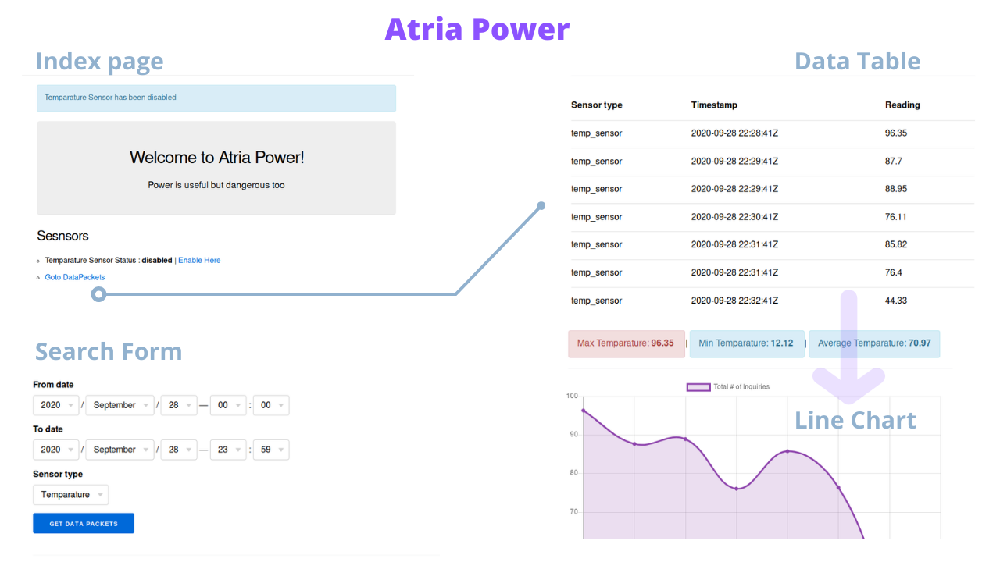

# Welcome AtriaPower



## Project Highlighted Module

### AtriaPower.TempServer
This module simulates a sensor sending data using `GenServer` named as 
`AtriaPower.TempServer`.

It will start as soon as our phoenix app runs but it will be in a *disabled* 
state by default. An option is provided to enable this sensor.

## Development Technologies
At the moment of developing this project, I used the following versions of
Elixir and Erlang.

```elixir
iex> mix hex.info 

Hex:    0.20.5
Elixir: 1.10.4
OTP:    23.0.3

Built with: Elixir 1.10.0 and OTP 21.3

```
## Starting Application

To start the Phoenix server:

  * Install dependencies with `mix deps.get`
  * Create and migrate your database with `mix ecto.setup`
  * Install Node.js dependencies with `npm install` inside the `assets` directory
  * Start Phoenix endpoint with `mix phx.server`

Now you can visit [`localhost:4000`](http://localhost:4000) from your browser.

## API EndPoints

  * GET   `/` Basic index route to alll available routes
  * GET   `/sensors/enable/:sensor_type` To enable specific sensor to send data ex.. `/sensors/enable/temparature`
  * GET   `/sensors/disable/:sensor_type` To disable specific sensor from sending data ex.. `/sensors/disable/temparature`
  * GET   `/data_packets` To list out all packets in the given date time range, default it uses present day
  * POST  `/data_packets/search` A post request for filtering the datapackets based date and time including sensor
  * POST  `/data_packets` Used to send the packet from server to db - A storing purpose of a packet. 

## Database Setup
For quick setup I used the default values of *Postgres* database.

The following configuration is used

```elixir
  username: "postgres",
  password: "postgres",
  database: "atria_power_dev",
  hostname: "localhost",
```
Make sure to run a postgres server with above credentials. If not, then update 
the config inside `config/dev.exs` under `config :atria_power, AtriaPower.Repo`

A data migration file added to create a table named `data_packets`.

This table comprises the following schema

```elixir
  schema "data_packets" do
    field :reading, :float
    field :sensor_type, :string
    field :timestamp, :integer #bigint

    timestamps()
  end
```
## External Modules used

### [Timex](https://github.com/bitwalker/timex/)
Used for flexible timestamp values for conveting to datetime and to develop query filters based on.

### [Chart.Js](https://www.chartjs.org/)
Npm module for developing a LineChart.

Best Regards,
Ankanna
